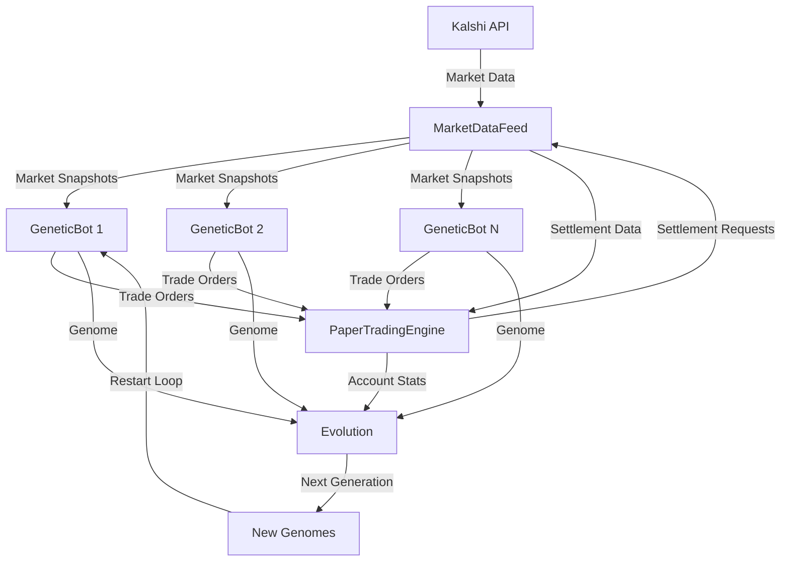

## System Components

The genetic algorithm trading system is built from several specialized components that work together to enable automated strategy evolution.

### Component Overview

```python
genetic/
├── genome.py          # Genome definition and decoding
├── evolution.py       # Selection, crossover, mutation
├── bot.py            # Individual trading bot logic
├── engine.py         # Paper trading simulation
├── feed.py           # Centralized market data
├── runner.py         # Main evolution loop
├── monitor.py        # Logging and progress tracking
├── persistence.py    # State saving and recovery
└── config.py         # System configuration
```

## Core Components

### Genome (`genome.py`)

Defines the genetic representation of trading strategies.

**Key Classes:**
- `Genome`: Dataclass with 22 floating-point genes (all in [0.0, 1.0])
- `decode_genome()`: Converts normalized gene values to actual trading parameters

**Gene Categories:**
- Market Selection (5 genes)
- Entry Signals (8 genes)
- Side Selection (2 genes)
- Position Sizing (3 genes)
- Risk Management (4 genes)

See [Genome Structure](/genetic/genome) for detailed gene definitions.

### Evolution Engine (`evolution.py`)

Implements genetic operators for creating new generations.

**Functions:**

<ParamField path="evaluate_fitness" type="function">
  Computes fitness = ROI% for a bot. Bots with fewer than 5 settled trades receive a large penalty (-100.0).
  
  ```python
  def evaluate_fitness(bot: GeneticBot) -> float:
      acct = bot.account
      if acct.n_settled < MIN_SETTLED_TRADES:
          return INACTIVE_FITNESS_PENALTY
      return acct.roi_pct
  ```
</ParamField>

<ParamField path="select_parent" type="function">
  Tournament selection: randomly samples 7 bots and returns the best.
  
  ```python
  def select_parent(population: list[GeneticBot]) -> GeneticBot:
      candidates = random.sample(population, TOURNAMENT_SIZE)
      return max(candidates, key=evaluate_fitness)
  ```
</ParamField>

<ParamField path="crossover" type="function">
  Uniform crossover: each gene randomly selected from parent A or B.
  
  ```python
  def crossover(parent_a: Genome, parent_b: Genome, gen_num: int) -> Genome:
      child = Genome(generation=gen_num, parent_ids=[parent_a.id, parent_b.id])
      for gene_name in Genome.gene_names():
          if random.random() < 0.5:
              setattr(child, gene_name, getattr(parent_a, gene_name))
          else:
              setattr(child, gene_name, getattr(parent_b, gene_name))
      return child
  ```
</ParamField>

<ParamField path="mutate" type="function">
  Gaussian mutation: each gene has 15% chance of being perturbed by N(0, 0.10), clamped to [0,1].
  
  ```python
  def mutate(genome: Genome) -> Genome:
      for gene_name in Genome.gene_names():
          if random.random() < MUTATION_RATE:  # 0.15
              old_val = getattr(genome, gene_name)
              delta = random.gauss(0, MUTATION_SIGMA)  # 0.10
              new_val = max(0.0, min(1.0, old_val + delta))
              setattr(genome, gene_name, new_val)
      return genome
  ```
</ParamField>

<ParamField path="evolve" type="function">
  Main evolution function that creates the next generation:
  
  1. **Elitism**: Top 5 bots survive unchanged
  2. **Breeding**: Fill remaining slots via tournament selection + crossover/mutation
  3. **Immigration**: Add 5 random new genomes for diversity
  
  Returns list of 100 genomes for the next generation.
</ParamField>

### Trading Bot (`bot.py`)

Individual bot that executes trades based on its genome.

**Class: `GeneticBot`**

```python
class GeneticBot:
    def __init__(self, genome: Genome, feed: MarketDataFeed, 
                 engine: PaperTradingEngine, known_categories: list[str],
                 bankroll: float = 100.0):
        self.genome = genome
        self.params = decode_genome(genome, known_categories)
        self.bot_id = f"bot_{genome.id}"
        self.account = engine.create_account(self.bot_id, bankroll)
```

**Main Method: `tick()`**

Called every 30 seconds during the trading period:

<Steps>
  <Step title="Check Limits">
    Verify daily trade count, loss limits, and max concurrent positions
  </Step>
  
  <Step title="Scan Markets">
    Get all open markets from the shared feed
  </Step>
  
  <Step title="Filter Markets">
    Apply genome-specific market filters (volume, time to expiry, category, price)
  </Step>
  
  <Step title="Generate Signal">
    Use the genome's signal type (price_level, momentum, mean_reversion, value, contrarian)
  </Step>
  
  <Step title="Execute Trade">
    If signal triggers, calculate position size and submit to paper trading engine
  </Step>
</Steps>

**Signal Types:**

- `price_level`: Buy when ask is in specific price range
- `momentum`: Buy based on price direction over lookback window
- `mean_reversion`: Buy when price deviates from mean by z-score threshold
- `value`: Buy whichever side is cheapest vs 50/50 fair value
- `contrarian`: Bet against the crowd when market is very confident

See [Fitness Evaluation](/genetic/fitness) for signal implementation details.

### Paper Trading Engine (`engine.py`)

Simulates trades without real money.

**Classes:**

<CodeGroup>
```python PaperPosition
@dataclass
class PaperPosition:
    id: str
    bot_id: str
    market_ticker: str
    side: str  # "yes" or "no"
    contracts: int
    entry_price: float  # Per contract, in dollars
    cost: float  # contracts * entry_price
    entry_time: datetime
    close_time: datetime | None
    
    # Filled on settlement
    settled: bool = False
    result: str = ""  # "yes" or "no" -- market outcome
    payout: float = 0.0  # contracts if won, else 0
    profit: float = 0.0  # payout - cost
    settle_time: datetime | None = None
```

```python BotAccount
@dataclass
class BotAccount:
    bot_id: str
    initial_bankroll: float = 100.0
    cash: float = 100.0
    open_positions: dict[str, PaperPosition]
    closed_positions: list[PaperPosition]
    total_trades: int = 0
    trades_today: int = 0
    daily_pnl: float = 0.0
    last_trade_date: str = ""
    
    @property
    def roi_pct(self) -> float:
        """Realized ROI from settled positions"""
        return (self.realized_pnl / self.initial_bankroll) * 100
    
    @property
    def win_rate(self) -> float:
        settled = [p for p in self.closed_positions if p.settled]
        wins = sum(1 for p in settled if p.profit > 0)
        return wins / len(settled) if settled else 0.0
```
</CodeGroup>

**Class: `PaperTradingEngine`**

Manages all bot accounts and simulates order fills:

```python
class PaperTradingEngine:
    def try_buy(self, bot_id: str, market_ticker: str, 
                side: str, usd_amount: float) -> PaperPosition | None:
        """
        Simulate a buy order:
        - Fills at displayed ask price (yes_ask or no_ask)
        - Integer contracts only (like real Kalshi)
        - Checks available cash
        - Prevents duplicate positions in same market
        """
```

**Settlement Process:**

1. **Passive checks**: Every tick, check cached settlement data
2. **Targeted checks**: Every 10 ticks (~5 min), query API for positions that passed close time
3. **Settlement wait**: After trading period, wait up to 4 hours for markets to settle
4. **Force close**: Any remaining unsettled positions closed as losses

### Market Data Feed (`feed.py`)

Centralized, thread-safe market data shared by all bots.

**Class: `MarketDataFeed`**

Runs in background thread, continuously fetching:

- **Open markets** closing within 24 hours
- **Price history** for momentum/mean-reversion signals
- **Settlement data** for position closing
- **Event categories** for market filtering

**Public API (thread-safe):**

```python
feed.get_open_markets() -> dict[str, MarketSnapshot]
feed.get_market(ticker: str) -> MarketSnapshot | None
feed.get_history(ticker: str) -> list[tuple[datetime, float]]
feed.get_settlement(ticker: str) -> str | None  # "yes", "no", or None
feed.get_categories() -> list[str]
```

<Note>
All bots read from the same shared feed, eliminating redundant API calls. The feed polls Kalshi every 30 seconds.
</Note>

## Data Flow



## Configuration

All system parameters in `config.py`:

```python genetic/config.py
POPULATION_SIZE = 100
INITIAL_BANKROLL = 100.0  # USD per bot

# Timing
GENERATION_DURATION_SECONDS = 24 * 3600  # 24 hours
TICK_INTERVAL_SECONDS = 30

# Evolution
ELITE_COUNT = 5
TOURNAMENT_SIZE = 7
CROSSOVER_RATE = 0.7
MUTATION_RATE = 0.15
MUTATION_SIGMA = 0.10
IMMIGRATION_COUNT = 5

# Fitness
MIN_SETTLED_TRADES = 5
INACTIVE_FITNESS_PENALTY = -100.0

# Market Data
MARKET_CLOSE_WINDOW_HOURS = 24
MARKET_HISTORY_MAX_TICKS = 120

# Settlement
SETTLEMENT_WAIT_HOURS = 4
SETTLEMENT_CHECK_TICKS = 10
```

## Persistence Layer

Automatic state saving for crash recovery and analysis:

**Files Created:**

- `data/evolution/gen_NNNN.json`: Complete generation state
- `data/evolution/checkpoint_genNNNN.json`: Mid-generation snapshots
- `data/evolution/hall_of_fame.json`: Top 20 performers all-time
- `data/evolution/latest.json`: Pointer to most recent generation
- `data/evolution/evolution.log`: Detailed event log

**Functions:**

```python
save_generation_state(generation, genomes, fitness_scores, stats)
load_latest_state() -> tuple[int, list[Genome]] | None
save_hall_of_fame(generation, top_entries)
save_checkpoint(generation, bots, tick_count)
```

## Performance Optimization

### Shared Resources

- **Single market data feed** shared by all bots (not 100 separate feeds)
- **Bulk API queries** using pagination and caching
- **Thread-safe read-only access** to market snapshots

### Minimal API Calls

- Background thread polls every 30 seconds
- Targeted settlement checks only for held positions
- Category refresh only every 5 minutes

### Efficient Data Structures

- Market snapshots stored in `dict[ticker, MarketSnapshot]` for O(1) lookup
- Price history limited to 120 ticks (1 hour at 30s intervals)
- Settlement cache expires after 2 hours

## Next Steps

<CardGroup cols={2}>
  <Card title="Genome Structure" icon="dna" href="/genetic/genome">
    Detailed breakdown of all 22 genes
  </Card>
  
  <Card title="Fitness Evaluation" icon="medal" href="/genetic/fitness">
    How bots are scored and ranked
  </Card>
  
  <Card title="Evolution Operators" icon="shuffle" href="/genetic/operators">
    Selection, crossover, and mutation mechanics
  </Card>
  
  <Card title="Quick Start" icon="rocket" href="/genetic/quickstart">
    Run evolution on your own machine
  </Card>
</CardGroup>